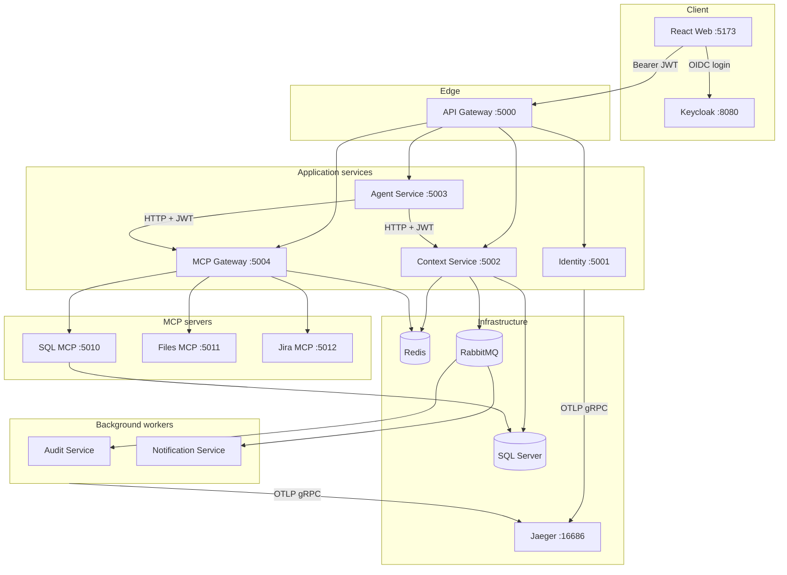
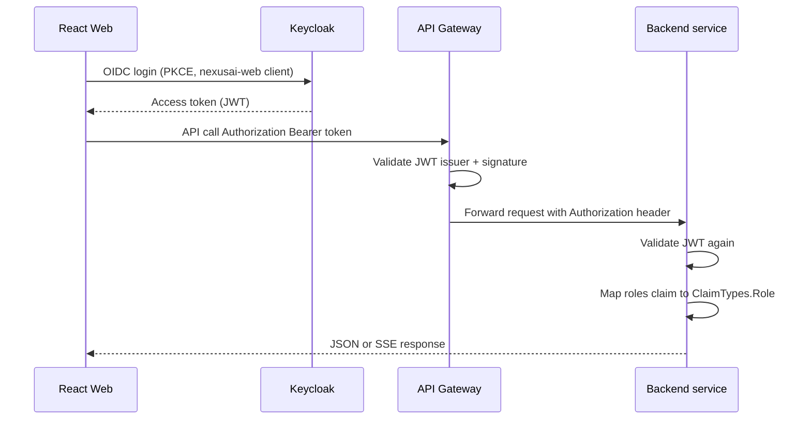
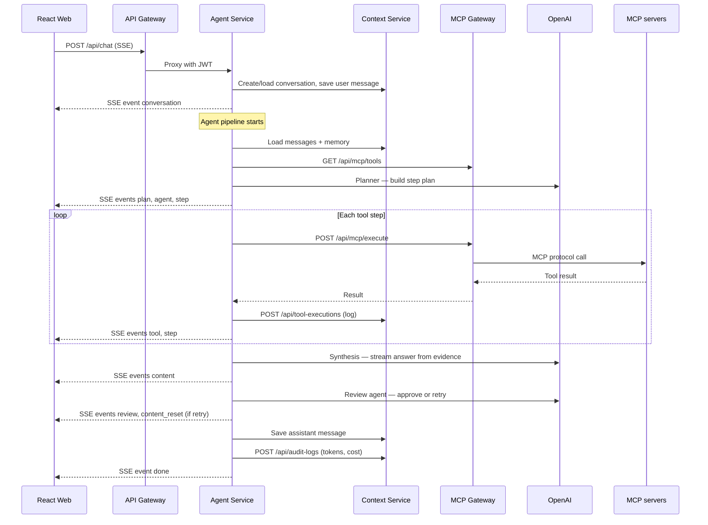
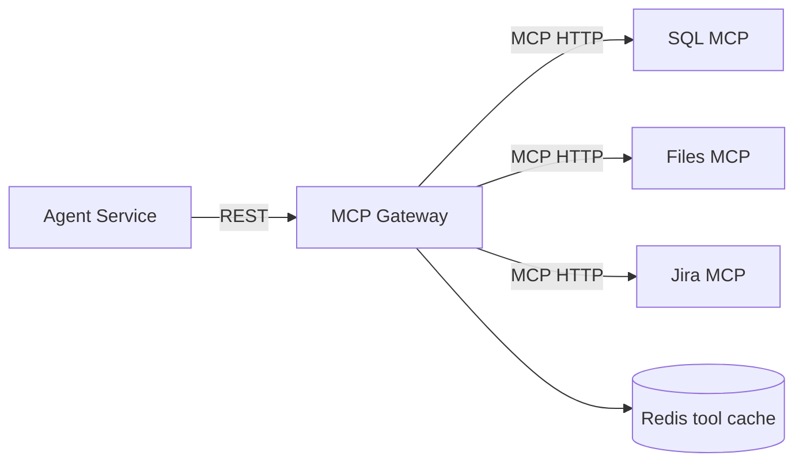
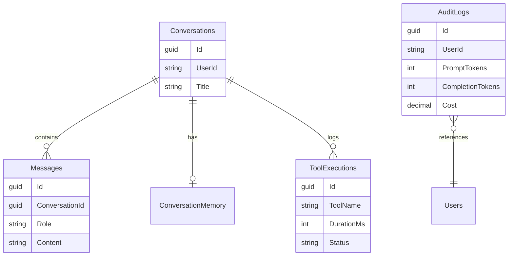
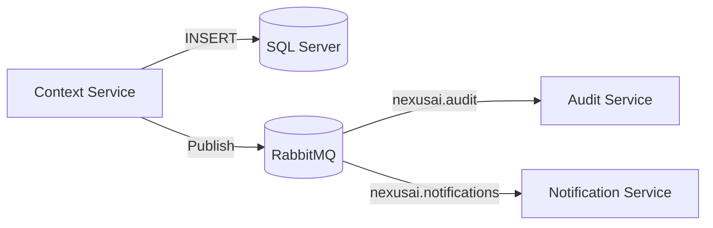

# NexusAI — How the System Works Together

This document explains how the platform components interact: request paths, data flow, authentication, agents, MCP tools, and deployment topologies.

For setup commands see [README.md](README.md). For feature phases see [ROADMAP.md](ROADMAP.md). For Kubernetes details see [infra/minikube/README.md](infra/minikube/README.md).

---

## 1. What NexusAI Is

NexusAI is an **enterprise AI assistant** that lets authenticated users chat with an LLM-backed agent. The agent can call **MCP (Model Context Protocol) tools** to query SQL databases, read documents, and create Jira incidents. Conversations, audit logs, and tool runs are persisted in **SQL Server**. An **admin dashboard** exposes token usage, audit trails, and MCP health.

Everything user-facing goes through a single **API Gateway** with **Keycloak JWT** validation.

---

## 2. High-Level Topology



---

## 3. Component Responsibilities

| Component | Port (local dev) | Role |
|-----------|------------------|------|
| **NexusAI.Web** | 5173 | React UI — chat, streaming timeline, admin dashboard |
| **Keycloak** | 8080 | OIDC identity provider; issues JWT access tokens |
| **NexusAI.ApiGateway** | 5000 | YARP reverse proxy, CORS, JWT validation, route table |
| **NexusAI.Identity** | 5001 | `/api/profile/me` — user id, email, roles from JWT |
| **NexusAI.ContextService** | 5002 | Conversations, messages, memory, audit/tool logs, admin APIs |
| **NexusAI.AgentService** | 5003 | Chat orchestration, Semantic Kernel, multi-agent pipeline, OpenAI |
| **NexusAI.McpGateway** | 5004 | MCP client hub — discover tools, health checks, execute tools |
| **NexusAI.McpServers.Sql** | 5010 | MCP tools: delayed shipments, read-only SQL |
| **NexusAI.McpServers.Files** | 5011 | MCP tools: read/search documents under `data/documents/` |
| **NexusAI.McpServers.Jira** | 5012 | MCP tools: create/list Jira incidents (mock JSON store) |
| **NexusAI.AuditService** | — (worker) | Consumes audit queue from RabbitMQ |
| **NexusAI.NotificationService** | — (worker) | Consumes notification queue (alerts) |
| **SQL Server** | 1433 | Primary datastore |
| **Redis** | 6380 (host) | MCP tool catalog cache |
| **RabbitMQ** | 5672 / 15672 | Async audit and notification messaging |
| **Jaeger** | 16686 / 4317 | Distributed tracing (OTLP gRPC) |

Shared libraries:

- **NexusAI.Contracts** — DTOs shared across services (chat, MCP, admin, messaging).
- **NexusAI.SharedKernel** — Redis, RabbitMQ publisher, OpenTelemetry bootstrap, Keycloak JWT helper.

---

## 4. Authentication Flow



**Key points:**

- The browser never talks to backend services directly (except via gateway URL `http://localhost:5000`).
- Tokens are issued for issuer `http://localhost:8080/realms/nexusai`.
- In Docker/Kubernetes, services fetch JWKS from an **internal** Keycloak hostname but validate the **browser issuer** via `Keycloak:Issuer` (see `NexusKeycloakAuthExtensions` in SharedKernel).
- Roles: `user` (chat) and `admin` (admin dashboard). Admin routes use `[Authorize(Roles = "admin")]`.

---

## 5. Chat Request Lifecycle

This is the main user flow when someone sends a message.



### Multi-agent pipeline (Agent Service)

| Phase | Agent | Purpose |
|-------|-------|---------|
| Memory | `MemoryAgent` | Summarize conversation history + stored memory for context |
| Planner | `PlannerAgent` | LLM creates an ordered plan; may reference MCP tools by name |
| Tool | `ToolAgent` | Executes plan steps via MCP Gateway (Semantic Kernel plugins) |
| Synthesis | LLM stream | Drafts final answer from plan + tool evidence |
| Review | `ReviewAgent` | Validates answer; may trigger one retry with feedback |

The UI renders this as a **streaming timeline** (phases, plan steps, tool calls, review status).

### SSE event types

`conversation` · `agent` · `plan` · `step` · `tool` · `content` · `content_reset` · `review` · `done` · `error`

---

## 6. MCP Tool System

MCP servers expose tools over HTTP. The **MCP Gateway** is the only component Agent Service talks to.



| MCP server | Example tools | Data source |
|------------|---------------|-------------|
| SQL | `get_delayed_shipments`, `execute_read_only_query` | SQL Server `Shipments` table |
| Files | `read_document`, `search_documents` | `data/documents/` on disk |
| Jira | `create_incident`, `list_incidents` | `data/jira/issues.json` (mock) |

**Discovery:** On startup (and via `POST /api/mcp/refresh`), MCP Gateway connects to each configured server, lists tools, and caches the catalog in Redis.

**Execution:** Agent Service calls `POST /api/mcp/execute` with `serverId`, `toolName`, and arguments. MCP Gateway forwards to the correct MCP server and returns structured results.

**Admin visibility:** `GET /api/mcp/tools` and `GET /api/mcp/health` (via gateway) power the admin dashboard MCP panels.

---

## 7. Data & Persistence



**Context Service** owns the EF Core `NexusDbContext`, runs migrations on startup, and seeds sample shipment data.

**Internal write APIs** (called by Agent Service, not the browser directly):

- `POST /api/tool-executions` — log each MCP tool run
- `POST /api/audit-logs` — log token usage and cost per chat turn

---

## 8. Async Messaging (Audit & Notifications)

After each chat completion, Context Service persists audit data to SQL **and** publishes an event to RabbitMQ.



- **Audit Service** — background worker; processes audit queue (extensible for external SIEM/export).
- **Notification Service** — background worker; handles high-cost or alert-style notifications.

Chat works without workers running; audit rows still land in SQL, but queue consumers will not process messages until workers start.

---

## 9. API Gateway Routing

YARP routes in `NexusAI.ApiGateway/appsettings.json` map public paths to backend clusters:

| Path prefix | Backend |
|-------------|---------|
| `/api/profile/*` | Identity |
| `/api/conversations/*`, `/api/admin/*`, `/api/audit-logs`, `/api/tool-executions` | Context Service |
| `/api/chat` | Agent Service |
| `/api/mcp/*` | MCP Gateway |

Every route (except `/api/health`) uses JWT authorization at the gateway. Backend services validate the token again on arrival.

---

## 10. Observability

All HTTP services register **OpenTelemetry** via `NexusTelemetry` in SharedKernel:

- ASP.NET Core + HttpClient instrumentation
- Export via **OTLP gRPC** to Jaeger (`http://localhost:4317`)
- View traces at **http://localhost:16686**

Set `OpenTelemetry:Enabled` to `false` in `appsettings.json` when Jaeger is not running.

---

## 11. Frontend Structure

| Area | Location | Notes |
|------|----------|-------|
| Auth | `src/NexusAI.Web/src/auth/` | Keycloak-js, `AuthProvider`, role checks |
| Chat API | `src/NexusAI.Web/src/api/client.ts` | Conversations, SSE chat stream |
| Admin API | `src/NexusAI.Web/src/api/admin.ts` | Dashboard, MCP tools/health |
| Chat UI | `src/NexusAI.Web/src/pages/ChatPage.tsx` | Streaming messages + timeline |
| Admin UI | `src/NexusAI.Web/src/pages/AdminPage.tsx` | Stats, logs, MCP status |

Environment variables (`.env`):

```env
VITE_API_BASE_URL=http://localhost:5000
VITE_KEYCLOAK_URL=http://localhost:8080
VITE_KEYCLOAK_REALM=nexusai
VITE_KEYCLOAK_CLIENT_ID=nexusai-web
```

---

## 12. Deployment Topologies

Three ways to run the same architecture:

### A. Local development (`dotnet run` + `npm run dev`)

- Infrastructure only: `docker compose up -d` (SQL, Keycloak, Redis, RabbitMQ, Jaeger)
- Each .NET service on its own port (5000–5004, 5010–5012)
- Vite dev server on 5173 with hot reload

### B. Docker full stack (`docker-compose.full.yml`)

- All services + frontend (nginx) as containers
- Single command: build + `up -d`
- Browser: http://localhost:5173, API: http://localhost:5000

### C. Minikube (`minikube-deploy.ps1` / `.sh`)

- Same images deployed to a local Kubernetes cluster
- Deploy script builds images into Minikube Docker, applies `infra/minikube/`, starts port-forwards
- Browser still uses localhost URLs via kubectl port-forward

See [README.md — Deploy overview](README.md#deploy-overview) for commands.

---

## 13. Configuration Cheat Sheet

| Concern | Where to configure |
|---------|-------------------|
| Gateway routes | `src/NexusAI.ApiGateway/appsettings.json` → `ReverseProxy` |
| Keycloak realm/users | `infra/keycloak/nexusai-realm.json` |
| JWT authority/issuer | `Keycloak:Authority` + `Keycloak:Issuer` in appsettings or Docker/K8s env |
| OpenAI model/key | `OpenAI:*` in Agent Service appsettings or `OPENAI_API_KEY` env |
| MCP server endpoints | `McpServers` in MCP Gateway appsettings |
| SQL connection | `ConnectionStrings:NexusDb` in Context Service / MCP SQL |
| Redis | `ConnectionStrings:Redis` (host port **6380** in local Docker) |
| RabbitMQ | `ConnectionStrings:RabbitMq` |
| OTLP / Jaeger | `OpenTelemetry:OtlpEndpoint` |

---

## 14. Typical End-to-End Example

**User prompt:** *"Which shipments from Thailand are delayed more than 3 days?"*

1. Browser sends message to `POST /api/chat` with JWT.
2. Agent Service loads conversation context from Context Service.
3. Planner selects SQL MCP tool `get_delayed_shipments`.
4. Tool Agent executes via MCP Gateway → SQL MCP → SQL Server query.
5. Results stream back as SSE `tool` and `step` events.
6. LLM synthesizes a natural-language summary from query results.
7. Review agent approves (or requests one revision).
8. Assistant message saved; audit log records token usage and cost.
9. UI displays final answer with expandable tool timeline.

---

## 15. Related Documentation

| Document | Contents |
|----------|----------|
| [README.md](README.md) | Prerequisites, deploy commands, API table, troubleshooting |
| [ROADMAP.md](ROADMAP.md) | Phased delivery history and future work |
| [infra/minikube/README.md](infra/minikube/README.md) | Kubernetes manifests and Minikube-specific notes |
| [.cursor/rules/opentelemetry-jaeger.mdc](.cursor/rules/opentelemetry-jaeger.mdc) | OTLP exporter conventions |
| [.cursor/rules/docker-infra-ports.mdc](.cursor/rules/docker-infra-ports.mdc) | Port mapping conventions (Redis 6380, Jaeger tags) |
